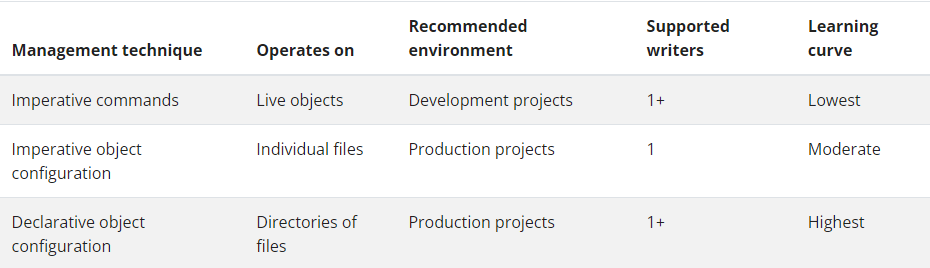

# Kubectl Imperative Resource Management

Mit kubectl können wir Kubernetes Resourcen auf eine imperative Art verwalten.

Siehe https://kubernetes.io/docs/concepts/overview/working-with-objects/object-management/ für die verschiedenen Verwaltungsstile und ihre Anwendungsfälle.

## [Live Demo vom 2. September 2024](.\01-kubectl-live-demo.md)