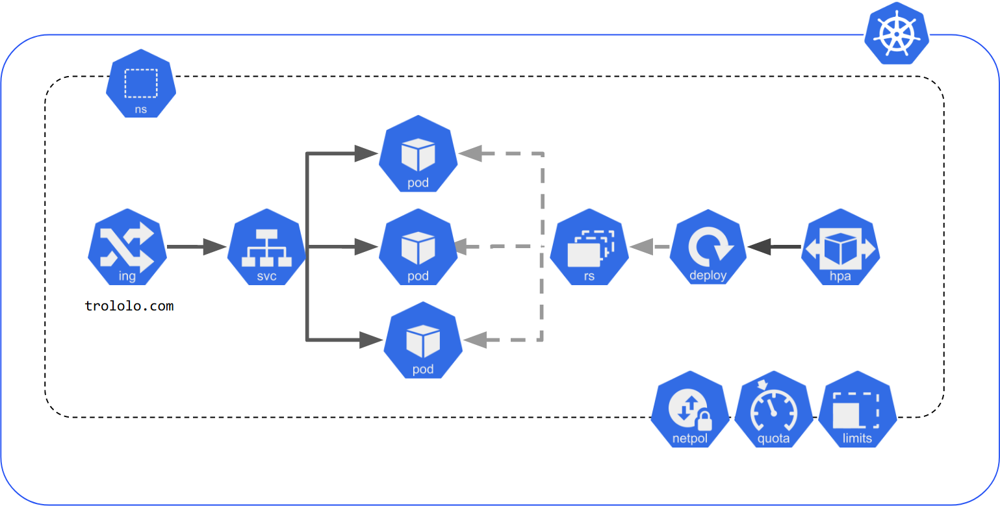

# Übung 2 - Unsere ersten eigenen Service!

Nachdem ihr in der ersten Übung vorallem Kommandos herumkopiert habt, kommt ihr jetzt dazu, eure eigenen Kubernetes Manifests zu erstellen und zu konfigurieren.

Nehmt eure Applikation aus dem Mikroservices Modul hervor und sucht eure `compose.yml` oder `docker-compose.yml` Datei raus. 

Ich werde mich am "Autoshop" Beispiel von Marcel orientieren. Das entsprechende `docker-compose.yml` File findet ihr hier: https://gitlab.com/ch-mc-b/autoshop-ms/app/shop/-/blob/main/docker-compose.yml

Um zu illustrieren, wie dies aussehen könnte: 

## Compose-Services zu Kubernetes-Objekten

In der compose Datei sind Services deklariert, die je einen Container beinhalten.

Wir brauchen jetzt Kubernetes Objekte, die die Container abbilden können. Welche üblichen Kubernetes Objekte haben die Möglichkeit einen Container zu deklarieren?

### Handgestrickt

Ich empfehle, für einen der Mikroservices einmal dieses Tutorial durchzugehen: 

https://kubernetes.io/docs/tutorials/kubernetes-basics/

Wenn ihr irgendwo unsicher seid, wie das alles zusammenpasst und wie die verschiedenen Konfigurationsoptionen funktionieren, findet ihr hier konzeptuelle Dokumentation: https://kubernetes.io/docs/concepts/workloads/

Und ihr könnt natürlich auch immer mich fragen. 

### Automatische Konversion

Hoffentlich habt ihr jetzt ein bisschen ein Gefühl, wie so ein Service auf Kubernetes deployed wird. 

Um uns ein bisschen Tipparbeit zu sparen, verwenden wir jetzt aber ein Werkzeug um das docker compose File zu konvertieren.

`Kompose` ist eine Software vom Kubernetes Projekt, die docker-compose Dateien zu Kubernetes Manifests konvertiert.

Installiert sie mit: 

- `winget install --id=Kubernetes.kompose  -e`
- `brew install kompose`

Dokumentation dazu findet ihr hier: https://kompose.io/getting-started/ 

Ihr könnt der Minikube Sektion folgen, das sollte zu Kind keinen Unterschied machen. 

## Ingress erstellen

Damit wir unsere Applikation per Hostnamen aufrufen können, müssen wir noch einen Ingress erstellen. 

- Einführung: https://kubernetes.github.io/ingress-nginx/user-guide/basic-usage/
- Konzept-Doku: https://kubernetes.io/docs/concepts/services-networking/ingress/

Schaut euch die Einführung an und versucht euch einen Ingress für eure Applikation zusammenzustellen. 

### Bonuspunkte: TLS

Wenn ihr fertig seid und eine Herausforderung braucht, versucht ein (innerhalb von eurem Cluster valides) Zertifikat mit eurem Ingress generieren zu lassen. 

Tipps:
- Wir haben auf unseren Cluster die Software "cert-manager" installiert.
- Es gibt einen "ClusterIssuer" namens "custom-ca-issuer".
- Ihr werdet "annotations" am Ingress vornehmen müssen.

